# QLEVR Dataset Generation

This is the code used to generate the QLEVR dataset as described in the paper:

**[QLEVR: A Diagnostic Dataset for Quantificational Language and Elementary Visual 
Reasoning](https://arxiv.org/abs/2205.03075)**

Presented at Findings of NAACL 2022

The QLEVR dataset [can be found here](https://drive.google.com/drive/folders/1s0n4CQXr1IDmBVUymYH51iC1MF54jyhN?usp=sharing).

**Abstract:** <br />
Synthetic datasets have successfully been used to probe visual question-answering datasets for their reasoning 
abilities. [CLEVR](http://cs.stanford.edu/people/jcjohns/clevr/), for example, tests a range of visual reasoning abilities. 
The questions in CLEVR focus on comparisons of shapes, colors, and sizes, numerical reasoning, and existence claims. 
This paper introduces a minimally biased, diagnostic visual question-answering dataset, 
QLEVR, that goes beyond existential and numerical quantification and focus on more complex quantifiers 
and their combinations, e.g., asking whether there are more than two red balls that are smaller than at least three 
blue balls in an image. We describe how the dataset was created and present a first evaluation of state-of-the-art 
visual question-answering models, showing that QLEVR presents a formidable challenge to our current models.

You can use this code to generate 2D images, render synthetic 3D images and generate questions and answers for those images, like this:

<div align="center">
  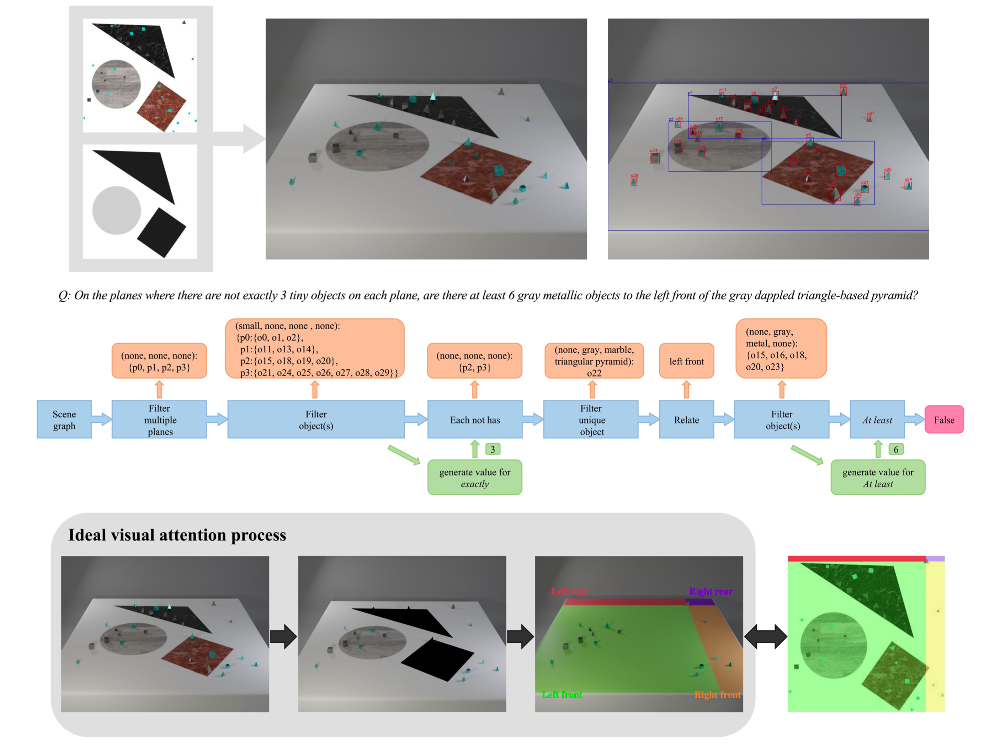
</div>

If you find this code useful, please cite

```
@inproceedings{li2022qlevr,
  title={QLEVR: A Diagnostic Dataset for Quantificational Language and Elementary Visual Reasoning},
  author={Li, Zechen and Søgaard, Anders},
  booktitle={Findings of the Association for Computational Linguistics: NAACL},
  year={2022}
}
```

## Step 1: Generating 2D Images
First, we construct a scene graph for a two-dimensional image containing areas and objects of different sizes 
and shapes. You can generate some 2D images with following script:

```bash
python gen_2d.py --split 'train' --start_idx 0 --num_images 100 --output_dir output/2d_scene/
```

After this command terminates you should have 100 images stored in output/2d_scene/train/full_images like this:

<div align="center">
  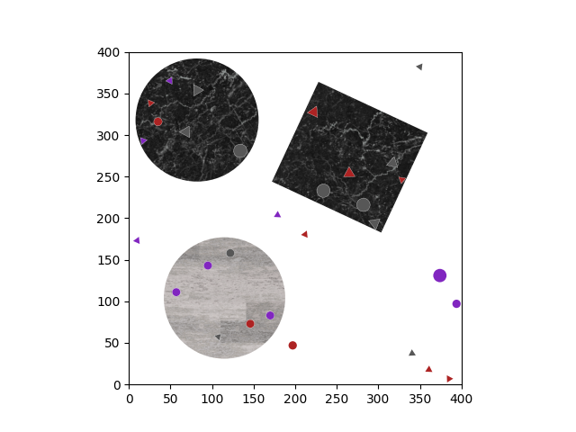
  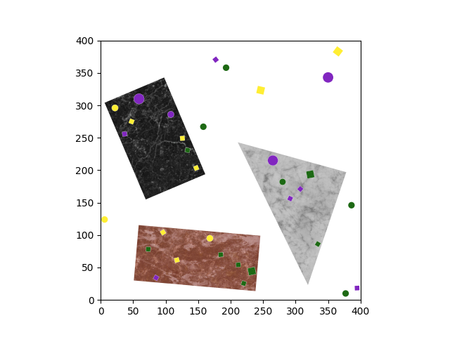
  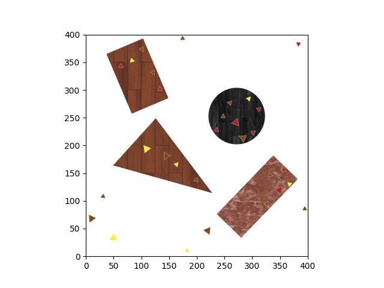
  <br>
  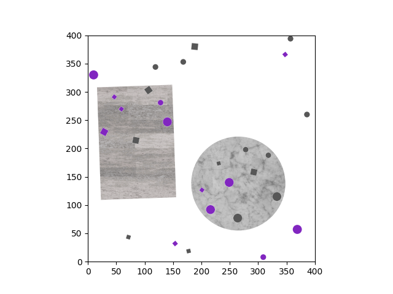
  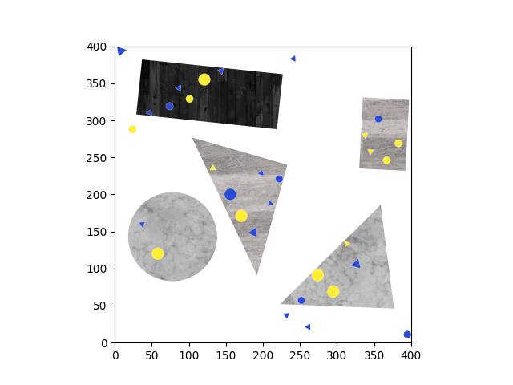
  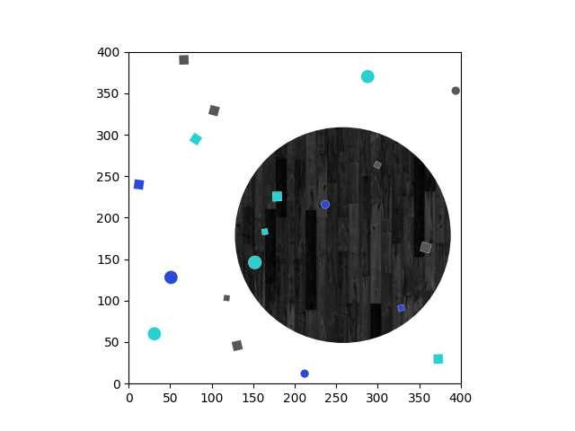
</div>

The file `output/2d_scene/train/scenes_2d_train.json` will contain ground-truth locations, bounding boxes, attributes 
and relationships for the planes and objects for these images.

## Step 2: Generating 3D Images
Second, we render synthetic 3D images using [Blender 2.93](https://www.blender.org/). 

[Here](https://github.com/sujeendran/BlenderRenderWithColab/blob/main/BlenderRenderWithColab.ipynb) is a tutorial about 
running command-line Blender renders on Google Colab for fast rendering. 
You can check my code about [rendering using Colab here](image_generation/gen_3d_images.ipynb).

Then you should have some rendered images stored in `output/3d_scene/train` like these:

<div align="center">
  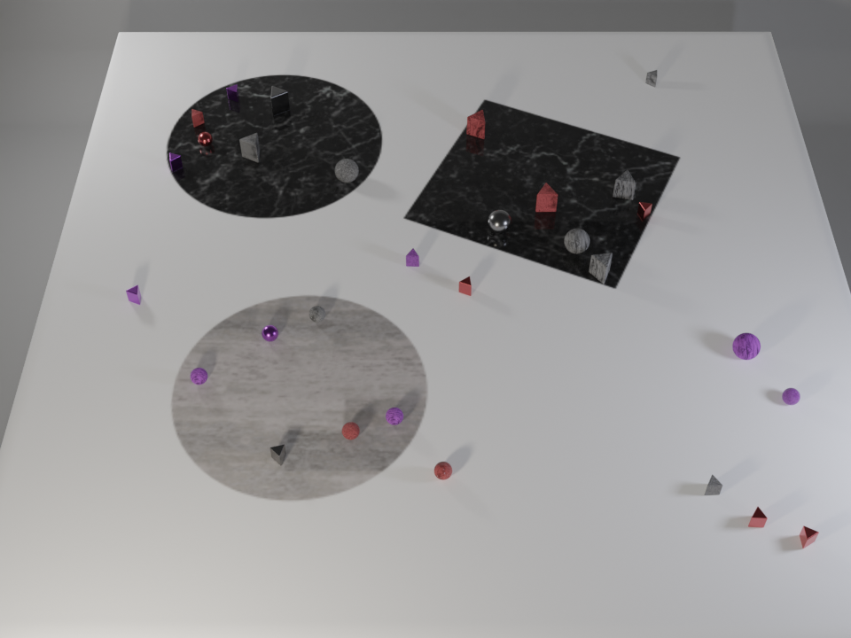
  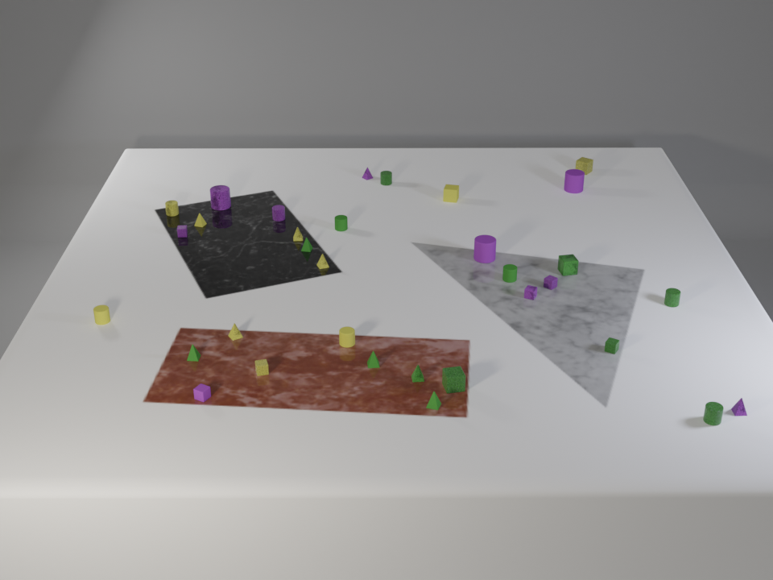
  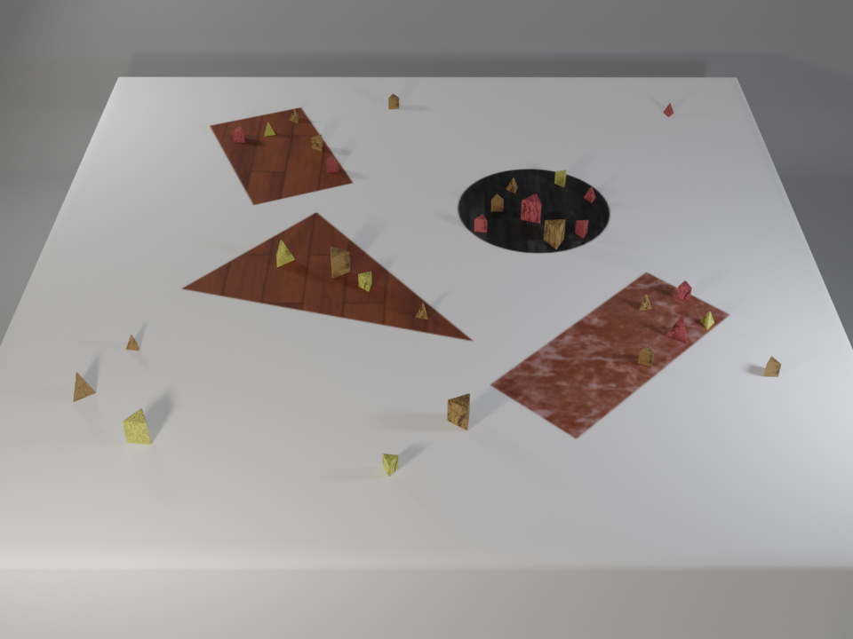
  <br>
  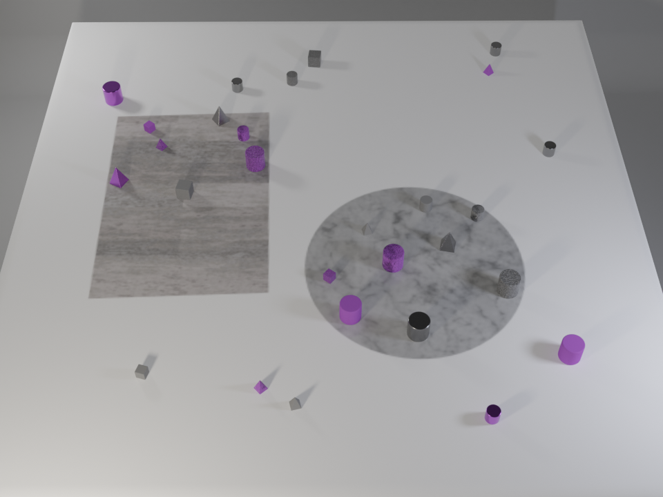
  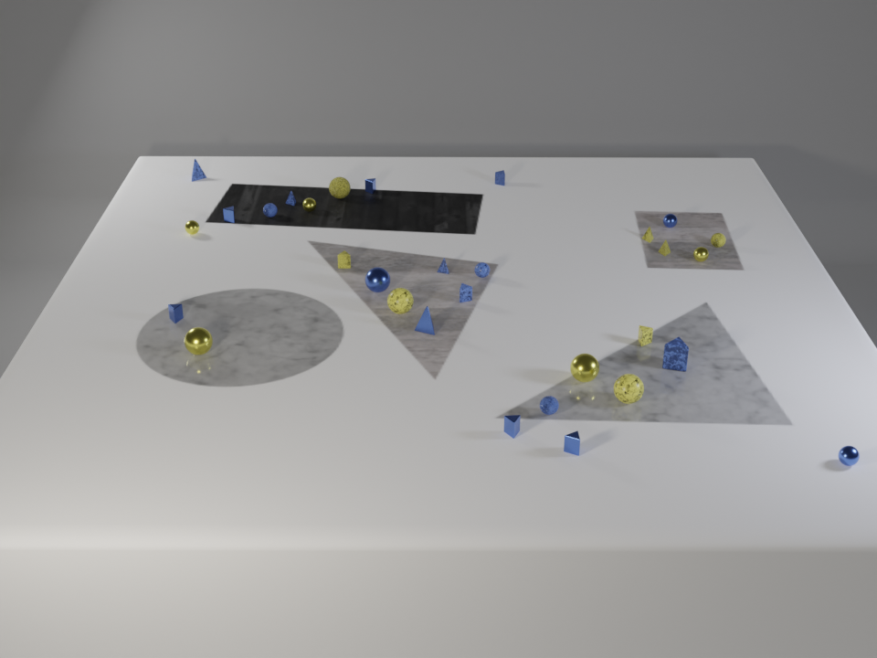
  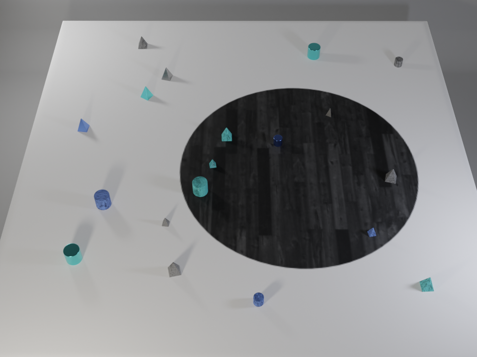
</div>

The file `output/3d_scene/train/scenes_3d_train.json` will contain rendering settings, ground-truth locations, 
bounding boxes, attributes and relationships for the planes and objects for these images.

## Step 3: Generating Questions
Then, we generate questions and answers for the rendered images generated in the previous steps. 
This step takes the JSON file `scenes_3d_train.json` containing all ground-truth scene information as input, 
and outputs a JSON file `questions_train.json` containing questions, answers, and operators for the questions, 
and outputs a JSON file `storage_train.json` that records the distribution of question templates used in real time.

```bash
cd question_generation
python gen_qa.py --input_scene_file 'output/3d_scene/train/scenes_3d_train.json \' 
                 --output_questions_file 'output/3d_scene/train/questions_train.json' \
                 --output_storage_file 'output/3d_scene/train/storage_train.json' \
                 --save_times 200 --num_retries 1000 
```
